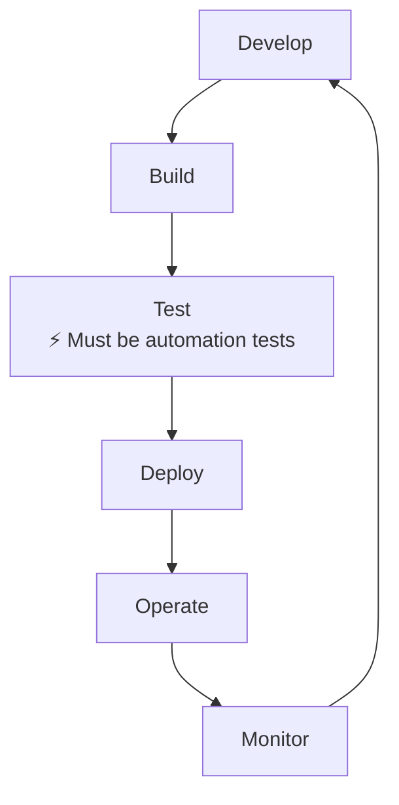
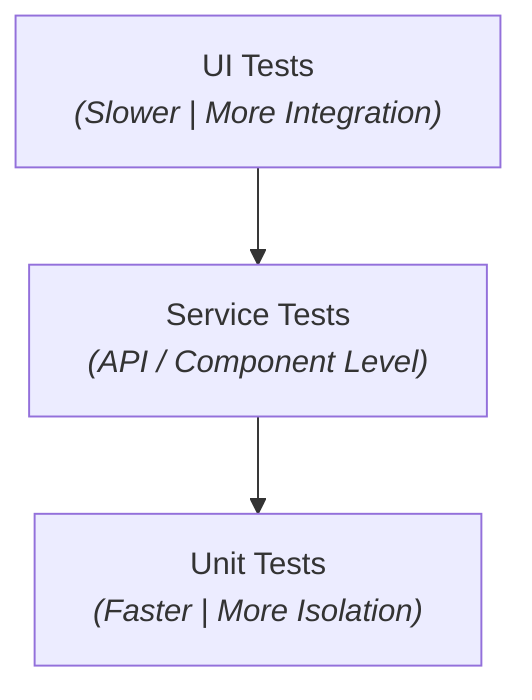
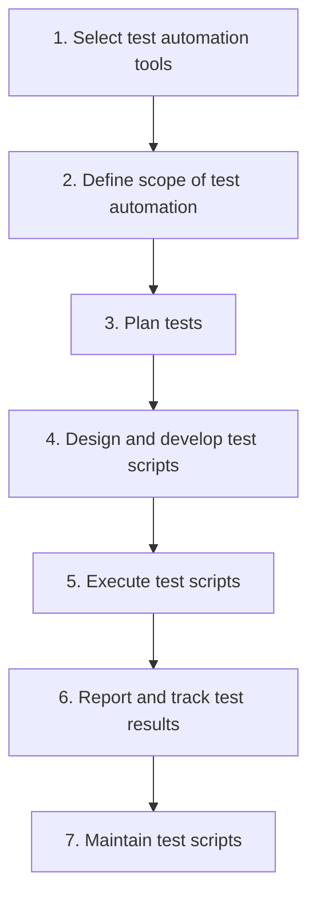
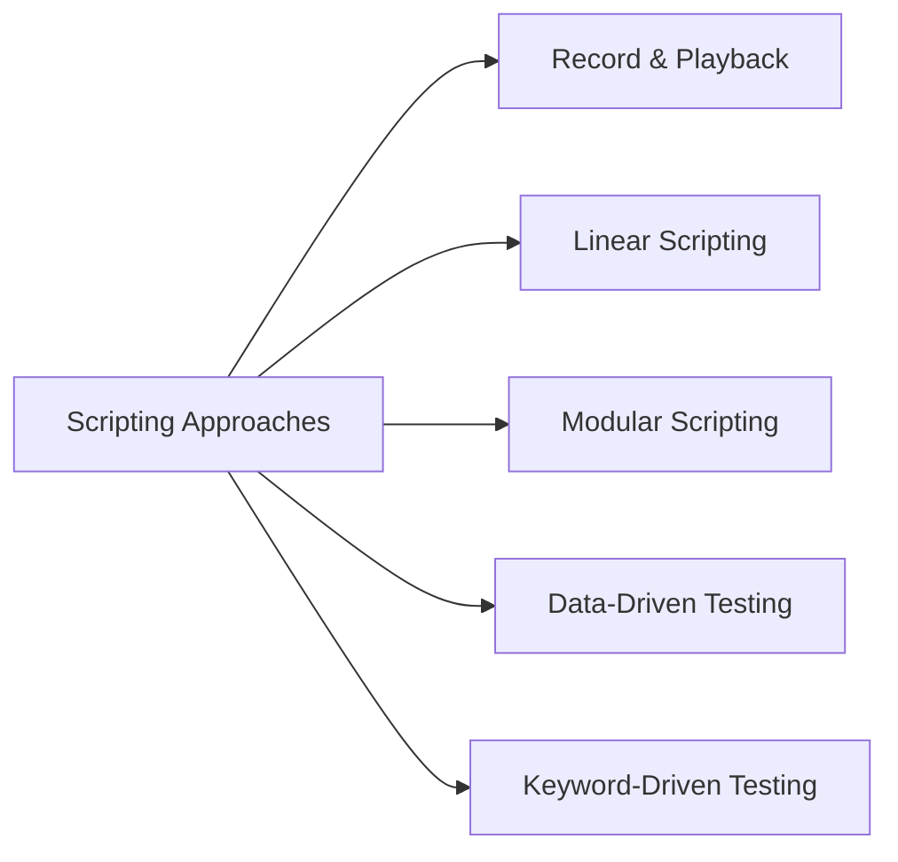
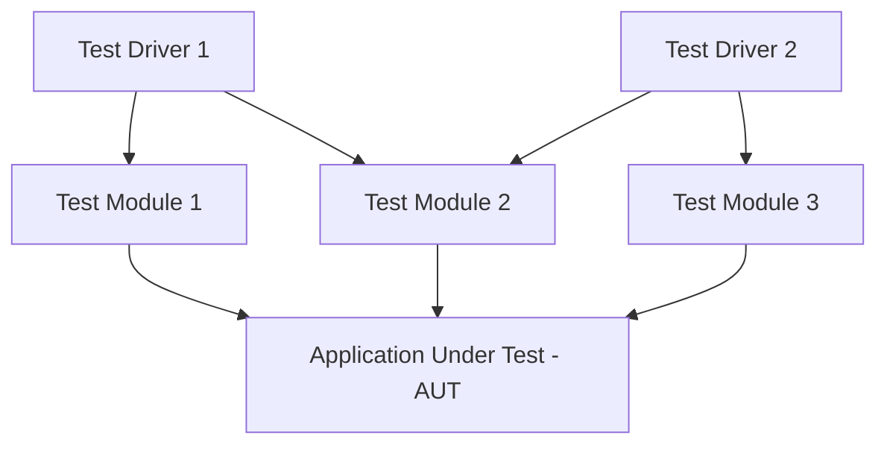
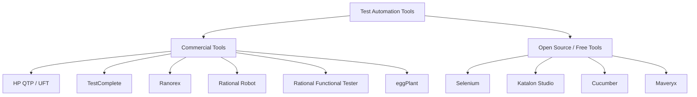

# Software Testing: Automation Testing

**Author:** Tran Duy Hoang  
**Department:** Department of Software Engineering – FIT@HCMUS  
**Source Document:** `ref/10_Automation Testing.pdf`

---

## Table of Contents

1. [Overview of Test Automation](#1-overview-of-test-automation)
   - [What is Test Automation?](#what-is-test-automation)
   - [Why Test Automation?](#why-test-automation)
   - [Benefits of Test Automation](#benefits-of-test-automation)
   - [Test Automation in DevOps](#test-automation-in-devops)
   - [When Test Automation Works Best](#when-test-automation-works-best)
   - [Testing Types Using Automation](#testing-types-using-automation)
   - [When Test Automation is Not Suitable](#when-test-automation-is-not-suitable)
   - [Challenges of Test Automation](#challenges-of-test-automation)
   - [Levels of Test Automation (Test Pyramid)](#levels-of-test-automation-test-pyramid)
2. [Typical Test Automation Process](#2-typical-test-automation-process)
   - [Process Steps](#process-steps)
   - [Step 1: Select Automation Tools](#step-1-select-automation-tools)
   - [Step 2: Define Scope of Test Automation](#step-2-define-scope-of-test-automation)
   - [Step 3: Plan Tests](#step-3-plan-tests)
   - [Step 4: Design and Develop Test Scripts](#step-4-design-and-develop-test-scripts)
   - [Step 5: Execute Tests, Report and Track Test Results](#step-5-execute-tests-report-and-track-test-results)
   - [Step 6: Maintain Test Scripts](#step-6-maintain-test-scripts)
3. [Scripting Approaches](#3-scripting-approaches)
   - [Record and Playback](#record-and-playback)
   - [Linear Scripting](#linear-scripting)
   - [Modular Scripting](#modular-scripting)
   - [Data-Driven Testing](#data-driven-testing)
   - [Keyword-Driven Testing](#keyword-driven-testing)
4. [Automation Tools](#4-automation-tools)
   - [Commercial vs. Open Source Tools](#commercial-vs-open-source-tools)
   - [Popular Commercial and Open Source Tools](#popular-commercial-and-open-source-tools)
   - [Skills for Working in Test Automation](#skills-for-working-in-test-automation)
5. [Conclusions](#5-conclusions)

---

## 1. Overview of Test Automation

### What is Test Automation?

- **Definition:** Test automation refers to the use of software tools to execute tests.
- **Capabilities:** Automated testing tools can:
  - Enter data automatically into applications.
  - Run test execution scripts.
  - Compare actual results with expected results.
  - Generate and report test results.
- **Manual Testing vs. Automated Testing:**
  - **Manual testing:** Tests are performed directly by human testers.
  - **Automated testing:** Tests are performed automatically by computer software scripts.

---

### Why Test Automation?

- Manual testing is **time-consuming** and **cost-intensive**.
- Automation testing **shortens overall test execution** and project duration.
- Manual testing is **difficult or impossible** in certain scenarios:
  - **Multi-lingual sites:** Testing across multiple languages and locales.
  - **Performance testing:** Simulating thousands of concurrent users.
  - **Security testing:** Executing repetitive vulnerability scans.
- Automation helps **increase overall test coverage**.
- Manual testing can become **tedious, repetitive, and error-prone** over time.

---

### Benefits of Test Automation

#### Part 1: Efficiency & Time-to-Market
- **Saves Time and Cost:** Reduces manual testing overhead over long-term project lifecycles.
- **Faster Execution:** Runs significantly faster than manual test execution.
- **Early Time to Market:** Accelerated feedback loops allow quicker deployment cycles.
- **Reusable Testing:** Test scripts can be reused across builds, releases, and environments.

#### Part 2: Coverage & Quality
- **Wider Test Coverage:** Covers more application features, scenarios, and platforms.
- **Reliable Results:** Eliminates human fatigue and inconsistency during repetitive execution.
- **Improves Accuracy:** Ensures precise data entry and assertion checks.
- **Thorough Testing:** Allows tests to be run more frequently and comprehensively.

---

### Test Automation in DevOps

- **DevOps Definition:** A practice aimed at making the steps from Software Development to IT Operations seamless, quick, and continuous.
- **Impact:** Significantly reduces the total software delivery lifecycle time.
- **Current Trend:** Test automation is an essential prerequisite and core element of modern DevOps pipelines.

#### Continuous DevOps Lifecycle Diagram

---

### When Test Automation Works Best

Test automation yields the highest return on investment (ROI) when applied to:

- **High-risk, business-critical test cases:** Core user flows that cannot afford failure.
- **Repeatedly executed test cases:** Such as **Regression Testing** on every new build.
- **Tedious or complex manual test cases:** Scenarios requiring complex data calculations or repetitive inputs.
- **Time-consuming test cases:** Long end-to-end execution flows.
- **Performance testing:** Stress, load, and scalability testing.
- **Security testing:** Automated vulnerability scanning and penetration checks.

---

### Testing Types Using Automation

> *Source: "The most striking problems in test automation: A survey", 2018. Katalon.com*

| Testing Type | Automation Adoption Rate (%) |
| :--- | :---: |
| **Functional testing** | **84%** |
| **Regression testing** | **72%** |
| **Smoke testing** | **40%** |
| **User interface / Usability testing** | **37%** |
| **API testing** | **35%** |
| **Performance / Load / Stress testing** | **28%** |
| **Integration testing** | **28%** |
| **Mobile testing** | **25%** |
| **Security testing** | **7%** |
| **Portability testing** | **3%** |
| **Other** | **2%** |

---

### When Test Automation is Not Suitable

Automated testing is not recommended for:

- **Newly designed test cases:** Tests should be manually executed and verified at least once before automating.
- **Frequently changing requirements:** High maintenance effort outweighs automation benefits when features change constantly.
- **Ad-hoc test cases:** One-off exploratory or unstructured testing.
- **UI/UX testing:** Subjective evaluation dependent heavily on human aesthetics, judgment, and experience.

---

### Challenges of Test Automation

> *Source: "The most striking problems in test automation: A survey", 2018. Katalon.com*

| Challenge Description | Strongly Agree | Agree | Neutral | Disagree | Strongly Disagree |
| :--- | :---: | :---: | :---: | :---: | :---: |
| Requirements change too often | 20% | 39% | 22% | 14% | 4% |
| Lack of skilled and experienced test automation resources | 15% | 48% | 19% | 11% | 6% |
| Difficult to integrate different automation tools together | 13% | 39% | 28% | 15% | 5% |
| Do not have the right processes and methods for automation | 13% | 40% | 23% | 18% | 6% |
| Diverse applications and platforms to test | 11% | 39% | 29% | 17% | 5% |
| Difficult to prepare test data and environments | 11% | 41% | 23% | 20% | 5% |
| Difficult to integrate automation tools to DevOps processes | 10% | 35% | 33% | 17% | 5% |
| Cannot test the interactions between layers of software | 10% | 35% | 34% | 16% | 5% |
| Do not have time for test automation | 14% | 37% | 19% | 21% | 10% |
| Lack of support from senior management and/or customers | 14% | 31% | 26% | 18% | 10% |
| Platforms and testing environments change too often | 10% | 34% | 27% | 22% | 7% |
| Do not have the right automation tools and frameworks | 11% | 31% | 28% | 23% | 8% |
| Lack of mobile devices ready for testing | 11% | 28% | 30% | 20% | 10% |
| Do not realize the benefits of test automation | 10% | 23% | 20% | 28% | 19% |

---

### Levels of Test Automation (Test Pyramid)

Testing operates across multiple levels of software architecture:

- **Unit Testing:** Tests individual methods, functions, and classes in isolation.
- **Integration Testing:** Tests interactions between multiple integrated components/services.
- **System Testing:** Focuses on the complete system UI and end-to-end user features.

#### Test Pyramid Model

- **Top Layer (UI Tests):** Slower execution, higher integration effort, fewer in number.
- **Middle Layer (Service Tests):** Balanced execution speed and integration scope.
- **Bottom Layer (Unit Tests):** Fastest execution, highest component isolation, largest quantity.

---

## 2. Typical Test Automation Process

### Process Steps

The lifecycle of test automation follows a 7-step sequential workflow:

---

### Step 1: Select Automation Tools

- **Challenge:** Selecting tools suitable for the Application Under Test (AUT) is very complex and critical.
- **Types of Tools:**
  - **Commercial tools:** Powerful and feature-rich, but often expensive.
  - **Open-source tools:** Free to use, but may have limited functionality or fragmented support.
- **Evaluation Criteria:**
  - Budget constraints.
  - Ease of use and learning curve.
  - Supported scripting languages (JavaScript, Python, Java, C#, etc.).
  - Supported operating platforms (Windows, Linux, macOS, iOS, Android).
  - Availability of training materials.
  - Existing team experience and skill set.

---

### Step 2: Define Scope of Test Automation

- Determine which areas in the AUT should be **automated** vs. tested **manually**.
- **Key Areas to Consider for Automation:**
  - Core business-critical features.
  - Scenarios handling large amounts of data.
  - Common, shared functionalities across the application.
  - Reused business components.
  - High-complexity test cases.
  - Test cases required for **cross-browser** and multi-platform testing.

---

### Step 3: Plan Tests

Define comprehensive test plans and testing strategies:

- **Tools to be used:** Infrastructure, test runner, reporting frameworks.
- **Testing Approaches:**
  - Functional vs. non-functional, usability, performance, security testing.
  - Automation testing levels: Unit testing, integration testing, system testing, acceptance testing.
- **Schedule and Timeframe:** Execution frequency, milestone deadlines.
- **Staffing:** Assigning roles for script development and data maintenance.
- **Testing Strategy:** Defining manual vs. automated scope boundaries, target test environments, test data management strategy.

---

### Step 4: Design and Develop Test Scripts

- Design test cases and test data structures.
- Design and develop test automation frameworks and reusable test scripts.
- Evaluate script quality, stability, and maintainability.
- **Characteristics:**
  - Similar to traditional software development/programming.
  - **Test Framework:** A set of standardized rules, conventions, and guidelines for automation.
  - **Framework Components:** Software libraries, helper utilities, reusable modules, test drivers, and external data sources.

---

### Step 5: Execute Tests, Report and Track Test Results

- Run automated test scripts against the AUT.
- Test execution is typically orchestrated by automation tools or CI/CD servers.
- Actual test results are automatically compared against defined expected results.
- Test execution results and logs are generated in test reports (e.g., HTML reports).
- Identified defects are captured and automatically or manually entered into defect tracking systems (e.g., Jira, GitHub Issues).

---

### Step 6: Maintain Test Scripts

- Test scripts must be updated frequently as the application changes:
  - New application functions are added or updated.
  - Business requirements change.
- When developers modify source code, test scripts may break due to:
  - Function parameter changes.
  - GUI element / DOM object selector changes.
  - Output format changes.
- **Note:** Maintaining test scripts can be very time-consuming if the framework is poorly architected.

---

## 3. Scripting Approaches

Software testing automation utilizes 5 primary scripting design patterns:

---

### Record and Playback

#### Mechanics
- Tools record user interactions performed directly on the AUT (clicks, keystrokes, navigation).
- Scripts are generated automatically by the tool based on recorded actions.
- Tools play back recorded steps to re-test the application.
- A very popular feature included in many test automation tools.

#### Evaluation
- **Advantages:**
  - Extremely easy to use.
  - Requires no programming skills.
  - Excellent for quick learning and prototyping.
- **Disadvantages / Problems:**
  - Scripts can only be created after the AUT interface is fully developed.
  - Does not perform true verification unless manual checkpoints/assertions are inserted.
  - Restricted primarily to UI testing.
  - Small UI changes break script execution easily.
  - Difficult to manage and maintain over large script volumes.
- **Conclusion:** Not a suitable approach for complex or advanced test automation.

---

### Linear Scripting

- Test scripts are manually authored in a programming language to test the AUT.
- Scripts can also be generated initially via Record & Playback and then edited.
- **Structure:**
  - A test project contains multiple **test suites**.
  - A test suite contains one or more **test cases**.
- **Pros & Cons:**
  - Suitable for small, simple test cases.
  - Becomes unmaintainable and duplicate-heavy for large-scale test suites.

---

### Modular Scripting

- Test scripts are broken down and encapsulated into reusable **functions** or **modules**.
- Master **test drivers** invoke these modular functions to execute tests against the AUT.

- **Benefits:** High code reusability, reduced script duplication, modular maintenance.

---

### Data-Driven Testing

#### Characteristics
- **Data separation:** Test data is separated entirely from test execution scripts.
- Test scripts read input data and expected results automatically from external files (JSON, CSV, Excel, XML, Databases).
- Allows running a single test script with **multiple datasets and varying inputs**:
  - *Example:* Testing multiple username/password combinations across positive and negative scenarios.
- High flexibility when modifying or expanding test inputs.
- **Role Separation:**
  - **Developers / Automation Engineers:** Responsible for creating and maintaining test driver scripts.
  - **Testers / Domain Experts:** Responsible for creating and updating test data files without writing code.

#### Disadvantages
- High initial effort required to build the parser framework and helper libraries.
- New test workflows still require new driver scripts written by programmers.
- **Conclusion:** Best solution for medium-to-large scale test automation suites.

---

### Keyword-Driven Testing

#### Characteristics
- Separates test scripts into three distinct components:
  1. Test execution framework.
  2. Test data.
  3. Directives (**keywords**) defining actions to perform on data (e.g., `ClickButton`, `EnterText`, `VerifyText`).
- Keywords and data collectively drive the test execution process.

#### Evaluation
- **Advantages:**
  - All application tests can be controlled through a unified framework.
  - Test cases can be built simply by composing sequences of keywords.
  - Non-programmers can design and execute complex automated tests.
  - Complete separation of test data, keywords, and engine code.
- **Disadvantages:**
  - Requires significant upfront engineering effort to develop the keyword engine.
  - Requires advanced programming skills to build and maintain the core framework.
- **Conclusion:** Powerful solution supported by major commercial test automation tools.

---

## 4. Automation Tools

### Commercial vs. Open Source Tools

Hundreds of test automation tools are available in the market:

- **Commercial Tools:**
  - *Pros:* Powerful capabilities, dedicated vendor support, comprehensive feature sets.
  - *Cons:* Expensive licensing costs.
- **Open Source Tools:**
  - *Pros:* Free of cost, open community customization.
  - *Cons:* Variable tool quality, uncertain vendor support, requires higher technical expertise.

---

### Popular Commercial and Open Source Tools

---

### Skills for Working in Test Automation

To succeed as a Test Automation Engineer:

- **Programming Skills (Essential):**
  - Scripting/programming languages: Python, JavaScript/TypeScript, Java, C#, Ruby, etc.
- **Technical Skills:**
  - **Regular Expressions (Regex):** For pattern matching, locator parsing, and dynamic text validation.
  - **SQL:** For database verification, test data setup, and backend assertions.
- **Tool Mastery:**
  - Learning and mastering industry-standard automation frameworks such as **Selenium**, **Playwright**, or **Katalon Studio**.

---

## 5. Conclusions

1. **Test Automation is a Major Trend:**
   - Modern software development clients actively demand automated testing.
   - High industry demand for skilled test automation engineers.
2. **Essential for DevOps:**
   - Continuous integration and deployment (CI/CD) pipelines cannot function effectively without automated test suites.
3. **Manual Testing Remains Necessary:**
   - Test automation **does not replace manual testing** entirely; it complements manual testing by automating repetitive and regression tasks.
