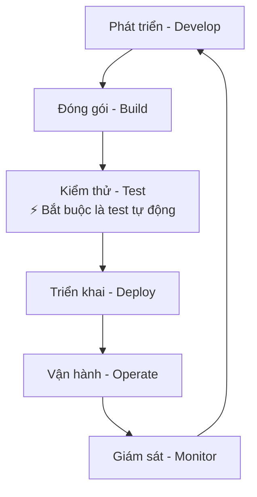
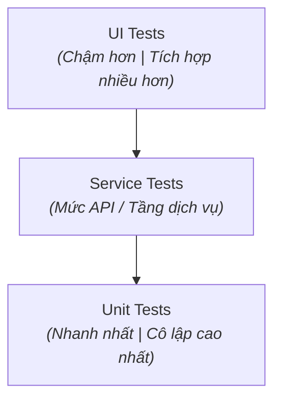
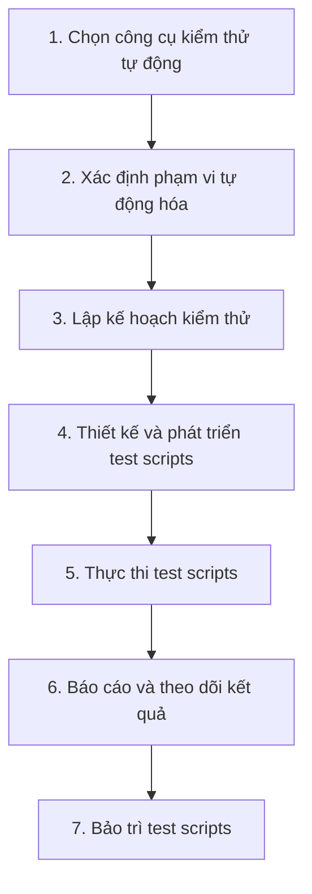
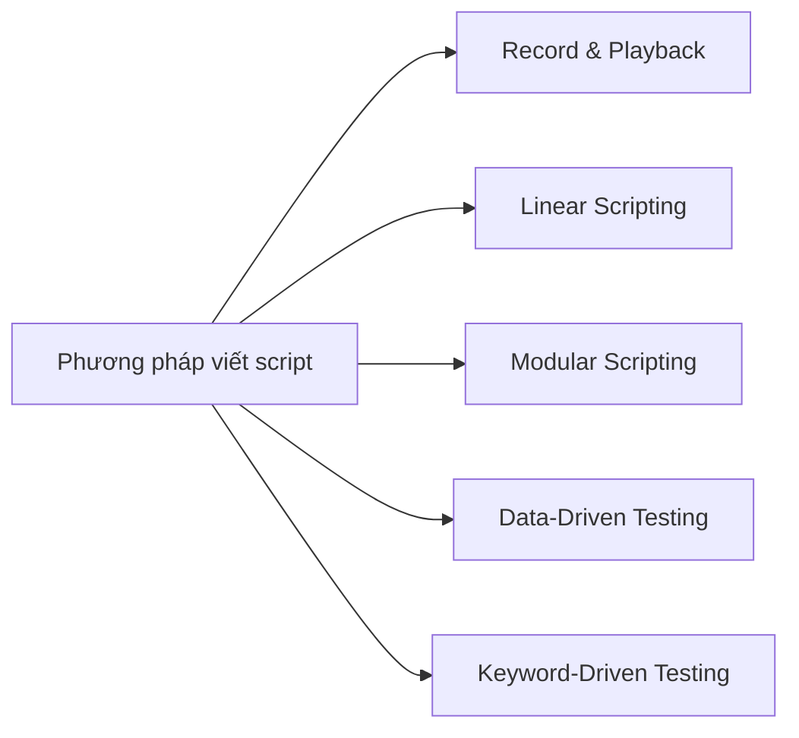
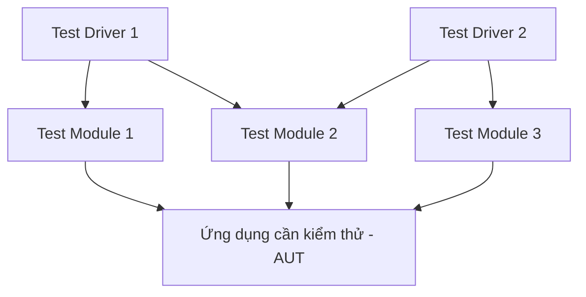
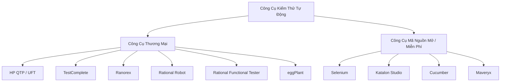

# Kiểm Thử Phần Mềm: Kiểm Thử Tự Động (Automation Testing)

**Tác giả:** Trần Duy Hoàng  
**Đơn vị:** Bộ môn Công nghệ Phần mềm – Khoa CNTT, Trường Đại học Khoa học Tự nhiên (FIT@HCMUS)  
**Tài liệu gốc:** `ref/10_Automation Testing.pdf`

---

## Mục Lục

1. [Tổng Quan Về Kiểm Thử Tự Động](#1-tổng-quan-về-kiểm-thử-tự-động)
   - [Kiểm Thử Tự Động Là Gì?](#kiểm-thử-tự-động-là-gì)
   - [Tại Sao Phải Kiểm Thử Tự Động?](#tại-sao-phải-kiểm-thử-tự-động)
   - [Lợi Ích Của Kiểm Thử Tự Động](#lợi-ích-của-kiểm-thử-tự-động)
   - [Kiểm Thử Tự Động Trong DevOps](#kiểm-thử-tự-động-trong-devops)
   - [Khi Nào Kiểm Thử Tự Động Đạt Hiệu Quả Caot Nhất?](#khi-nào-kiểm-thử-tự-động-đạt-hiệu-quả-cao-nhất)
   - [Các Loại Kiểm Thử Sử Dụng Tự Động Hóa](#các-loại-kiểm-thử-sử-dụng-tự-động-hóa)
   - [Khi Nào Không Nền Dùng Kiểm Thử Tự Động?](#khi-nào-không-nên-dùng-kiểm-thử-tự-động)
   - [Thách Thức Của Kiểm Thử Tự Động](#thách-thức-của-kiểm-thử-tự-động)
   - [Các Mức Độ Kiểm Thử Tự Động (Kim Tự Tháp Kiểm Thử)](#các-mức-độ-kiểm-thử-tự-động-kim-tự-tháp-kiểm-thử)
2. [Quy Trình Kiểm Thử Tự Động Điển Hình](#2-quy-trình-kiểm-thử-tự-động-điển-hình)
   - [Các Bước Trong Quy Trình](#các-bước-trong-quy-trình)
   - [Bước 1: Lựa Chọn Công Cụ Kiểm Thử Tự Động](#bước-1-lựa-chọn-công-cụ-kiểm-thử-tự-động)
   - [Bước 2: Xác Định Phạm Vi Kiểm Thử Tự Động](#bước-2-xác-định-phạm-vi-kiểm-thử-tự-động)
   - [Bước 3: Lập Kế Hoạch Kiểm Thử](#bước-3-lập-kế-hoạch-kiểm-thử)
   - [Bước 4: Thiết Kế Và Phát Triển Test Scripts](#bước-4-thiết-kế-và-phát-triển-test-scripts)
   - [Bước 5: Thực Thử, Báo Cáo Và Theo Dõi Kết Quả](#bước-5-thực-thi-báo-cáo-và-theo-dõi-kết-quả)
   - [Bước 6: Bảo Trì Test Scripts](#bước-6-bảo-trì-test-scripts)
3. [Các Phương Pháp Viết Kịch Bản (Scripting Approaches)](#3-các-phương-pháp-viết-kịch-bản-scripting-approaches)
   - [Record and Playback (Ghi và Phát lại)](#record-and-playback-ghi-và-phát-lại)
   - [Linear Scripting (Kịch bản tuyến tính)](#linear-scripting-kịch-bản-tuyến-tính)
   - [Modular Scripting (Kịch bản mô-đun)](#modular-scripting-kịch-bản-mô-đun)
   - [Data-Driven Testing (Kiểm thử theo dữ liệu)](#data-driven-testing-kiểm-thử-theo-dữ-liệu)
   - [Keyword-Driven Testing (Kiểm thử theo từ khóa)](#keyword-driven-testing-kiểm-thử-theo-từ-khóa)
4. [Các Công Cụ Kiểm Thử Tự Động](#4-các-công-cụ-kiểm-thử-tự-động)
   - [Công Cụ Thương Mại vs. Mã Nguồn Mở](#công-cụ-thương-mại-vs-mã-nguồn-mở)
   - [Các Công Cụ Phổ Biến](#các-công-cụ-phổ-biến)
   - [Kỹ Năng Cần Thiết Khi Làm Việc Trong Lĩnh Vực Automation Testing](#kỹ-năng-cần-thiết-khi-làm-việc-trong-lĩnh-vực-automation-testing)
5. [Kết Luận](#5-kết-luận)

---

## 1. Tổng Quan Về Kiểm Thử Tự Động

### Kiểm Thử Tự Động Là Gì?

- **Định nghĩa:** Kiểm thử tự động (Test Automation) là việc sử dụng các công cụ phần mềm chuyên dụng để thực thi các bài kiểm thử.
- **Khả năng thực hiện:** Các công cụ kiểm thử tự động có thể:
  - Tự động nhập dữ liệu vào ứng dụng.
  - Chạy các kịch bản kiểm thử (test scripts).
  - So sánh kết quả thực tế (actual results) với kết quả mong đợi (expected results).
  - Xuất báo cáo kết quả kiểm thử.
- **So sánh Kiểm thử thủ công vs. Kiểm thử tự động:**
  - **Kiểm thử thủ công (Manual testing):** Các bài kiểm thử được thực hiện trực tiếp bởi con người (tester).
  - **Kiểm thử tự động (Automated testing):** Các bài kiểm thử được thực hiện tự động bởi máy tính/kịch bản phần mềm.

---

### Tại Sao Phải Kiểm Thử Tự Động?

- Kiểm thử thủ công tốn **nhiều thời gian** và **chi phí cao**.
- Kiểm thử tự động giúp **rút ngắn thời gian kiểm thử** và tổng thời gian dự án.
- Kiểm thử thủ công **rất khó hoặc không thể thực hiện** trong một số tình huống:
  - **Trang web đa ngôn ngữ (Multi-lingual sites):** Kiểm thử trên nhiều ngôn ngữ và vùng miền khác nhau.
  - **Kiểm thử hiệu năng (Performance test):** Giả lập hàng nghìn người dùng truy cập đồng thời.
  - **Kiểm thử bảo mật (Security test):** Thực thi lặp đi lặp lại các bài quét lỗ hổng bảo mật.
- Tự động hóa giúp **tăng độ bao phủ kiểm thử (test coverage)**.
- Kiểm thử thủ công dễ trở nên **nhàm chán, tẻ nhạt và dễ phát sinh lỗi do con người**.

---

### Lợi Ích Của Kiểm Thử Tự Động

#### Phần 1: Chi Phí & Thời Gian Ra Thị Trường
- **Tiết kiệm thời gian và chi phí:** Giảm thiểu chi phí nhân công kiểm thử về lâu dài trong chu kỳ sống của dự án.
- **Nhanh hơn kiểm thử thủ công:** Tốc độ thực thi kịch bản nhanh hơn nhiều lần so với thao tác bằng tay.
- **Rút ngắn thời gian ra thị trường (Early time to market):** Vòng phản hồi nhanh giúp phát hành sản phẩm sớm hơn.
- **Tính tái sử dụng cao (Reusable testing):** Các test scripts có thể dùng lại cho nhiều phiên bản, môi trường và đợt phát hành.

#### Phần 2: Độ Bao Phủ & Chất Lượng
- **Độ bao phủ tính năng rộng hơn:** Kiểm thử được nhiều tính năng, kịch bản và nền tảng hơn.
- **Kết quả đáng tin cậy:** Loại bỏ sự mệt mỏi hay sai sót chủ quan của con người.
- **Tăng độ chính xác:** Đảm bảo nhập dữ liệu và so sánh kiểm tra chính xác 100%.
- **Kiểm thử thường xuyên và toàn diện hơn:** Cho phép chạy test suite liên tục với tần suất cao.

---

### Kiểm Thử Tự Động Trong DevOps

- **Khái niệm DevOps:** Là phương pháp luận kết hợp giữa Phát triển (Development) và Vận hành (Operations) nhằm giúp các bước chuyển giao phần mềm diễn ra nhanh chóng, dễ dàng và liên tục.
- **Tác động:** Giảm đáng kể tổng thời gian của chu kỳ sống phần mềm (software lifecycle time).
- **Xu hướng:** Kiểm thử tự động là yếu tố cốt lõi và bắt buộc trong các đường ống (pipelines) DevOps hiện đại.

#### Sơ Đồ Vòng Đời DevOps (DevOps Lifecycle)

---

### Khi Nào Kiểm Thử Tự Động Đạt Hiệu Quả Cao Nhất?

Kiểm thử tự động mang lại giá trị cao nhất khi áp dụng cho:

- **Các test cases rủi ro cao, quan trọng với nghiệp vụ (Business critical):** Các luồng tính năng cốt lõi không được phép lỗi.
- **Các test cases được thực thi lặp đi lặp lại:** Ví dụ như **Kiểm thử hồi quy (Regression Testing)** trên mỗi bản build mới.
- **Các test cases tẻ nhạt hoặc khó thực hiện thủ công:** Các kịch bản đòi hỏi tính toán phức tạp hoặc nhập liệu lặp lại.
- **Các test cases tốn nhiều thời gian:** Luồng kiểm thử end-to-end kéo dài.
- **Kiểm thử hiệu năng (Performance tests):** Kiểm thử tải, độ chịu đựng và khả năng mở rộng.
- **Kiểm thử bảo mật (Security tests):** Quét hổng tự động và kiểm tra truy cập.

---

### Các Loại Kiểm Thử Sử Dụng Tự Động Hóa

> *Nguồn: "The most striking problems in test automation: A survey", 2018. Katalon.com*

| Loại Kiểm Thử | Tỷ Lệ Áp Dụng Automation (%) |
| :--- | :---: |
| **Kiểm thử chức năng (Functional testing)** | **84%** |
| **Kiểm thử hồi quy (Regression testing)** | **72%** |
| **Kiểm thử khói (Smoke testing)** | **40%** |
| **Giao diện người dùng / Độ khả dụng (UI / Usability)** | **37%** |
| **Kiểm thử API (API testing)** | **35%** |
| **Kiểm thử hiệu năng / Tải / Chịu đựng (Performance/Load/Stress)** | **28%** |
| **Kiểm thử tích hợp (Integration testing)** | **28%** |
| **Kiểm thử di động (Mobile testing)** | **25%** |
| **Kiểm thử bảo mật (Security testing)** | **7%** |
| **Kiểm thử tính di động (Portability testing)** | **3%** |
| **Khác (Other)** | **2%** |

---

### Khi Nào Không Nên Dùng Kiểm Thử Tự Động?

Không nên áp dụng kiểm thử tự động cho:

- **Các test cases mới thiết kế:** Cần được kiểm thử thủ công ít nhất một lần trước khi tiến hành tự động hóa.
- **Các test cases thuộc yêu cầu thay đổi liên tục:** Chi phí bảo trì kịch bản sẽ vượt quá lợi ích mang lại.
- **Các test cases Ad-hoc (khảo sát đột xuất):** Kiểm thử khám phá, không có kịch bản cố định.
- **Kiểm thử UI/UX:** Đòi hỏi sự đánh giá cảm quan, trải nghiệm và thẩm mỹ của con người.

---

### Thách Thức Của Kiểm Thử Tự Động

> *Nguồn: "The most striking problems in test automation: A survey", 2018. Katalon.com*

| Khảo Sát Về Thách Thức | Rất Đồng Ý | Đồng Ý | Trung Lập | Không Đồng Ý | Rất Không Đồng Ý |
| :--- | :---: | :---: | :---: | :---: | :---: |
| Yêu cầu thay đổi quá thường xuyên | 20% | 39% | 22% | 14% | 4% |
| Thiếu nhân sự kiểm thử tự động có kỹ năng và kinh nghiệm | 15% | 48% | 19% | 11% | 6% |
| Khó tích hợp các công cụ tự động hóa khác nhau lại với nhau | 13% | 39% | 28% | 15% | 5% |
| Không có quy trình và phương pháp tự động hóa phù hợp | 13% | 40% | 23% | 18% | 6% |
| Ứng dụng và nền tảng cần kiểm thử quá đa dạng | 11% | 39% | 29% | 17% | 5% |
| Khó chuẩn bị dữ liệu kiểm thử và môi trường | 11% | 41% | 23% | 20% | 5% |
| Khó tích hợp công cụ tự động hóa vào quy trình DevOps | 10% | 35% | 33% | 17% | 5% |
| Không thể kiểm thử tương tác giữa các tầng phần mềm | 10% | 35% | 34% | 16% | 5% |
| Không có đủ thời gian làm kiểm thử tự động | 14% | 37% | 19% | 21% | 10% |
| Thiếu sự hỗ trợ từ quản lý cấp cao và/hoặc khách hàng | 14% | 31% | 26% | 18% | 10% |
| Nền tảng và môi trường kiểm thử thay đổi quá thường xuyên | 10% | 34% | 27% | 22% | 7% |
| Không có công cụ và framework tự động hóa phù hợp | 11% | 31% | 28% | 23% | 8% |
| Thiếu thiết bị di động sẵn sàng cho kiểm thử | 11% | 28% | 30% | 20% | 10% |
| Chưa nhận thức được lợi ích của kiểm thử tự động | 10% | 23% | 20% | 28% | 19% |

---

### Các Mức Độ Kiểm Thử Tự Động (Kim Tự Tháp Kiểm Thử)

Kiểm thử tự động được thực hiện trên nhiều cấp độ kiến trúc phần mềm:

- **Kiểm thử đơn vị (Unit Testing):** Kiểm thử các hàm, phương thức, lớp riêng lẻ trong mã nguồn.
- **Kiểm thử tích hợp (Integration Testing):** Kiểm thử sự tích hợp và tương tác giữa nhiều thành phần/dịch vụ.
- **Kiểm thử hệ thống (System Testing):** Tập trung vào giao diện UI và các tính năng end-to-end của người dùng.

#### Mô Hình Kim Tự Tháp Kiểm Thử (Test Pyramid)

- **Tầng Đỉnh (UI Tests):** Tốc độ chạy chậm nhất, chi phí tích hợp cao, số lượng bài test ít nhất.
- **Tầng Giữa (Service Tests):** Cân bằng giữa tốc độ và phạm vi tích hợp.
- **Tầng Đáy (Unit Tests):** Tốc độ chạy nhanh nhất, tính cô lập cao nhất, số lượng bài test nhiều nhất.

---

## 2. Quy Trình Kiểm Thử Tự Động Điển Hình

### Các Bước Trong Quy Trình

Quy trình tự động hóa kiểm thử gồm 7 bước tuần tự:

---

### Bước 1: Lựa Chọn Công Cụ Kiểm Thử Tự Động

- **Thách thức:** Chọn công cụ phù hợp với ứng dụng cần kiểm thử (AUT) là một công việc rất phức tạp và quan trọng.
- **Phân loại công cụ:**
  - **Công cụ thương mại (Commercial):** Mạnh mẽ, tính năng phong phú nhưng chi phí bản quyền đắt đỏ.
  - **Công cụ mã nguồn mở (Open source):** Miễn phí nhưng tính năng có thể hạn chế hoặc hỗ trợ không đồng đều.
- **Tiêu chí đánh giá:**
  - Ngân sách (Budget).
  - Độ dễ sử dụng (Ease of use).
  - Ngôn ngữ viết kịch bản (JavaScript, Python, Java, C#,...).
  - Nền tảng hỗ trợ (Windows, Linux, macOS, iOS, Android).
  - Tài liệu huấn luyện/đào tạo (Training).
  - Kinh nghiệm thực tế của đội ngũ (Team experience).

---

### Bước 2: Xác Định Phạm Vi Kiểm Thử Tự Động

- Xác định rõ khu vực nào trong AUT sẽ **tự động hóa** và khu vực nào sẽ **kiểm thử thủ công**.
- **Các khu vực cần xem xét tự động hóa:**
  - Các tính năng quan trọng đối với nghiệp vụ cốt lõi.
  - Các kịch bản có lượng dữ liệu lớn (large amount of data).
  - Các chức năng dùng chung giữa các ứng dụng.
  - Các thành phần nghiệp vụ được tái sử dụng.
  - Các test cases có độ phức tạp cao.
  - Các test cases phục vụ kiểm thử trên nhiều trình duyệt (cross-browser testing).

---

### Bước 3: Lập Kế Hoạch Kiểm Thử

Xác định kế hoạch kiểm thử và chiến lược tổng thể:

- **Công cụ sử dụng:** Test runner, thư viện assertion, báo cáo.
- **Phương pháp kiểm thử:**
  - Kiểm thử chức năng, phi chức năng, độ khả dụng, hiệu năng, bảo mật,...
  - Mức độ kiểm thử tự động: Unit test, system test, integration test, acceptance test.
- **Lịch trình và thời gian (Schedule & Timeframe):** Tần suất chạy test và các mốc bàn giao.
- **Nhân sự (Staffing):** Phân công trách nhiệm phát triển script và quản lý dữ liệu.
- **Chiến lược kiểm thử:** Ranh giới giữa kiểm thử thủ công vs tự động, môi trường kiểm thử.

---

### Bước 4: Thiết Kế Và Phát Triển Test Scripts

- Thiết kế test cases và cấu trúc dữ liệu kiểm thử.
- Thiết kế và phát triển framework tự động hóa và các script kiểm thử.
- Đánh giá chất lượng, độ ổn định và khả năng bảo trì của script.
- **Đặc điểm:**
  - Tương tự như quá trình lập trình phần mềm.
  - **Test Framework:** Là tập hợp các quy tắc, chuẩn mực và hướng dẫn cho việc tự động hóa.
  - **Thành phần Framework:** Bao gồm thư viện phần mềm, hàm tiện ích, module tái sử dụng, bộ điều khiển test (drivers) và nguồn dữ liệu.

---

### Bước 5: Thực Thi, Báo Cáo Và Theo Dõi Kết Quả

- Chạy các script kiểm thử tự động trên ứng dụng AUT.
- Việc thực thi thường được điều khiển tự động bởi công cụ kiểm thử hoặc CI/CD pipeline.
- Kết quả kiểm thực tế được tự động so sánh với kết quả mong đợi.
- Báo cáo kết quả kiểm thử được tạo tự động (ví dụ: Playwright HTML Report, Allure).
- Các lỗi (defects/bugs) được ghi nhận và đưa vào hệ thống quản lý lỗi (Jira, GitHub Issues).

---

### Bước 6: Bảo Trì Test Scripts

- Test scripts phải được cập nhật thường xuyên theo sự thay đổi của phần mềm:
  - Các tính năng mới được thêm vào hoặc nâng cấp.
  - Yêu cầu nghiệp vụ thay đổi.
- Khi lập trình viên thay đổi mã nguồn, test script có thể bị lỗi do:
  - Thay đổi tham số truyền vào (Parameters).
  - Thay đổi đối tượng giao diện (GUI objects/Selectors).
  - Thay đổi định dạng đầu ra (Outputs).
- **Lưu ý:** Việc bảo trì test scripts có thể tốn rất nhiều thời gian nếu framework thiết kế không tốt.

---

## 3. Các Phương Pháp Viết Kịch Bản (Scripting Approaches)

Có 5 phương pháp chính để viết kịch bản kiểm thử tự động:

---

### Record and Playback (Ghi và Phát lại)

#### Cơ chế hoạt động
- Công cụ ghi lại các thao tác của người dùng trên AUT (click, gõ phím, chuyển trang).
- Công cụ tự động sinh ra kịch bản (script) sau khi ghi xong.
- Công cụ phát lại (playback) chính xác những gì đã ghi để kiểm thử.
- Là tính năng rất phổ biến trong nhiều công cụ kiểm thử tự động.

#### Đánh giá
- **Ưu điểm:**
  - Rất dễ sử dụng.
  - Không cần kỹ năng lập trình.
  - Tốt cho việc học tập và thử nghiệm ban đầu.
- **Hạn chế / Nhược điểm:**
  - Chỉ tạo được script sau khi giao diện AUT đã sẵn sàng.
  - Không tự kiểm thử được nếu không chèn thêm các điểm kiểm tra (checkpoints/assertions).
  - Chỉ phù hợp với kiểm thử UI.
  - Thay đổi nhỏ trên UI cũng có thể khiến kịch bản dừng chạy.
  - Khó quản lý và bảo trì khi số lượng kịch bản lớn.
- **Kết luận:** Không phải là phương pháp tốt cho kiểm thử tự động nâng cao.

---

### Linear Scripting (Kịch bản tuyến tính)

- Kịch bản được viết bằng ngôn ngữ lập trình để kiểm thử AUT.
- Có thể tạo ban đầu bằng Record & Playback rồi chỉnh sửa lại.
- **Cấu trúc:**
  - Một dự án kiểm thử có nhiều **Test Suites**.
  - Một Test Suite chứa một hoặc nhiều **Test Cases**.
- **Đánh giá:**
  - Phù hợp với các test cases đơn giản.
  - Khó áp dụng cho các hệ thống tự động hóa lớn do lặp lại mã nguồn nhiều.

---

### Modular Scripting (Kịch bản mô-đun)

- Đặt các kịch bản kiểm thử vào các hàm (functions) hoặc mô-đun (modules) có thể tái sử dụng.
- Sử dụng các bộ điều khiển (**Test Drivers**) để gọi các mô-đun này thực thi trên AUT.

- **Lợi ích:** Tái sử dụng code cao, giảm thiểu lặp lại kịch bản, dễ bảo trì theo từng mô-đun.

---

### Data-Driven Testing (Kiểm thử theo dữ liệu)

#### Đặc điểm
- **Tách biệt dữ liệu:** Dữ liệu kiểm thử được tách rời hoàn toàn khỏi kịch bản kiểm thử.
- Script tự động đọc dữ liệu từ các file bên ngoài (JSON, CSV, Excel, XML, Cơ sở dữ liệu).
- Cho phép chạy 1 script với **nhiều bộ dữ liệu và đầu vào khác nhau**:
  - *Ví dụ:* Kiểm thử các kết hợp tên đăng nhập và mật khẩu khác nhau (đúng/sai/biên).
- Thao tác linh hoạt khi thay đổi dữ liệu đầu vào.
- **Phân chia vai trò rõ ràng:**
  - **Lập trình viên / Automation Tester:** Chịu trách nhiệm viết và bảo trì kịch bản driver.
  - **Manual Tester / Domain Expert:** Chịu trách nhiệm chuẩn bị và cập nhật dữ liệu kiểm thử mà không cần biết lập trình.

#### Nhược điểm
- Đòi hỏi công sức ban đầu lớn để xây dựng framework (parser, thư viện đọc dữ liệu,...).
- Các kịch bản test luồng mới vẫn cần viết thêm driver scripts mới.
- **Kết luận:** Là giải pháp xuất sắc cho các hệ thống kiểm thử tự động quy mô lớn.

---

### Keyword-Driven Testing (Kiểm thử theo từ khóa)

#### Đặc điểm
- Tách kịch bản kiểm thử thành 3 phần rõ rệt:
  1. Dữ liệu kiểm thử (Test data).
  2. Chỉ thị / Từ khóa (**Keywords**) hướng dẫn cách sử dụng dữ liệu (vd: `ClickButton`, `EnterText`, `VerifyText`).
  3. Kịch bản thực thi.
- Các từ khóa và dữ liệu trực tiếp điều khiển quá trình chạy test.

#### Đánh giá
- **Ưu điểm:**
  - Tất cả bài test có thể được quản lý bởi một framework duy nhất.
  - Bài test được tạo dễ dàng bằng cách ghép các từ khóa.
  - Người không biết lập trình vẫn có thể tạo và chạy bài test tự động.
  - Tách biệt hoàn toàn giữa dữ liệu test và script.
- **Nhược điểm:**
  - Tốn nhiều công sức để xây dựng framework từ khóa ban đầu.
  - Đòi hỏi kỹ năng lập trình cao để phát triển core framework.
- **Kết luận:** Là giải pháp tốt được hỗ trợ bởi nhiều công cụ thương mại lớn.

---

## 4. Các Công Cụ Kiểm Thử Tự Động

### Công Cụ Thương Mại vs. Mã Nguồn Mở

Có hàng trăm công cụ kiểm thử tự động trên thị trường:

- **Công cụ thương mại (Commercial tools):**
  - *Ưu điểm:* Thường rất mạnh mẽ, được hỗ trợ kỹ thuật tốt, bộ tính năng phong phú.
  - *Nhược điểm:* Chi phí bản quyền rất đắt đỏ.
- **Công cụ mã nguồn mở (Open source tools):**
  - *Ưu điểm:* Miễn phí hoàn toàn.
  - *Nhược điểm:* Chất lượng không đồng đều, hỗ trợ kỹ thuật không chắc chắn, đòi hỏi kỹ thuật cao.

---

### Các Công Cụ Phổ Biến

---

### Kỹ Năng Cần Thiết Khi Làm Việc Trong Lĩnh Vực Automation Testing

Để trở thành một Automation Test Engineer thành công:

- **Kỹ năng lập trình (Điểm cộng bắt buộc):**
  - Ngôn ngữ kịch bản/lập trình: Python, JavaScript/TypeScript, Java, C#, Ruby,...
- **Kỹ năng kỹ thuật phụ trợ:**
  - **Biểu thức chính quy (Regular Expressions - Regex):** Tìm kiếm chuỗi, xử lý locator và validation.
  - **SQL:** Truy vấn cơ sở dữ liệu để kiểm tra dữ liệu backend và chuẩn bị test data.
- **Làm chủ công cụ kiểm thử:**
  - Học và sử dụng thạo các công cụ hàng đầu như **Selenium**, **Playwright**, hoặc **Katalon Studio**.

---

## 5. Kết Luận

1. **Kiểm thử tự động là xu hướng lớn:**
   - Khách hàng và các dự án hiện đại luôn yêu cầu áp dụng tự động hóa.
   - Nhu cầu nhân lực kiểm thử tự động trên thị trường rất cao.
2. **Yếu tố thiết yếu cho DevOps:**
   - Quy trình CI/CD và DevOps không thể hoạt động hiệu quả nếu thiếu kiểm thử tự động.
3. **Không thay thế hoàn toàn kiểm thử thủ công:**
   - Kiểm thử tự động **không thay thế kiểm thử thủ công**; nó đóng vai trò hỗ trợ giải phóng sức người ở các bài test lặp đi lặp lại và kiểm thử hồi quy.
