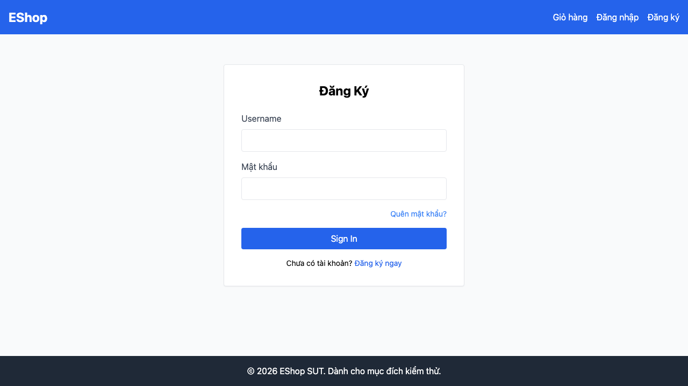

# Báo Cáo Bug HW04

## Ngữ Cảnh Lần Chạy

- MSSV: 23127326
- Timestamp lần chạy test: 2026-08-20T15:45:31Z
- Trình duyệt: Chromium, Firefox, WebKit
- Tổng số lượt chạy: 132
- Số lượt không đạt: 72
- Báo cáo HTML: `submit/playwright-report/index.html`
- Artifact lỗi: `submit/test-results/` và `submit/playwright-report/data/`

Các bug bên dưới được gom từ những failure lặp lại trên 3 trình duyệt. Link GitHub Issue trỏ tới issue public đã tạo cho từng nhóm bug được xác nhận.

## BUG-01: Login API Trả Về Password Của User

- Tính năng: FR-02 Đăng nhập và khóa tài khoản
- Mức độ nghiêm trọng: Nghiêm trọng
- Test liên quan: `FR02-TC01 Login succeeds with valid default user`
- Trình duyệt ghi nhận: Chromium, Firefox, WebKit
- Ảnh chụp màn hình: `submit/screenshots/BUG-01-password-leak-login-response.png`
- GitHub Issue: https://github.com/HCMUS-software-testing/HW04/issues/1

### Các Bước Tái Hiện

1. Khởi động backend của SUT.
2. Gửi `POST /api/login` với thông tin đăng nhập hợp lệ của user mặc định.
3. Kiểm tra body JSON trong response.

### Kết Quả Mong Đợi

Response chỉ nên chứa thông tin xác thực và các trường profile an toàn. Response không được trả về password của user.

### Kết Quả Thực Tế

Body response có thuộc tính `password`. Giá trị password cụ thể được ẩn trong báo cáo này vì lý do bảo mật, làm assertion `not.toHaveProperty("password")` thất bại.

## BUG-02: Form Login Dùng Text Input Thay Vì Email Input

- Tính năng: FR-02 Đăng nhập và khóa tài khoản
- Mức độ nghiêm trọng: Trung bình
- Test liên quan: `FR02-TC03 Login form rejects malformed email before submit`
- Trình duyệt ghi nhận: Chromium, Firefox, WebKit
- Ảnh chụp màn hình: `submit/screenshots/BUG-02-login-email-input-type.png`
- GitHub Issue: https://github.com/HCMUS-software-testing/HW04/issues/2

### Các Bước Tái Hiện

1. Mở trang login của customer web app.
2. Kiểm tra field username/email.
3. Nhập email sai định dạng và submit form.

### Kết Quả Mong Đợi

Field login nên dùng kiểm tra email cấp trình duyệt hoặc cơ chế kiểm tra tương đương trước khi gửi request với email sai định dạng.

### Kết Quả Thực Tế

Field có type là `text`, không phải `email`. Trình duyệt không áp dụng cơ chế kiểm tra email sẵn có cho input sai định dạng.

## BUG-03: Thời Gian Khóa Tài Khoản Không Khớp Yêu Cầu

- Tính năng: FR-02 Đăng nhập và khóa tài khoản
- Mức độ nghiêm trọng: Cao
- Test liên quan: `FR02-TC07 Account is locked after three consecutive wrong passwords`
- Trình duyệt ghi nhận: Chromium, Firefox, WebKit
- Ảnh chụp màn hình: `submit/screenshots/BUG-03-lockout-duration.png`
- GitHub Issue: https://github.com/HCMUS-software-testing/HW04/issues/3

### Các Bước Tái Hiện

1. Reset trạng thái user mặc định.
2. Submit sai mật khẩu 3 lần liên tiếp.
3. Đọc giá trị `locked_until` trong database.

### Kết Quả Mong Đợi

Tài khoản nên bị khóa khoảng 30 giây theo kỳ vọng test được rút ra từ HW02.

### Kết Quả Thực Tế

Thời gian khóa còn lại quan sát được khoảng 180 giây, không khớp với cửa sổ lockout 30 giây.

## BUG-04: Coupon API Trả Lỗi Minimum Order Cho Total Không Hợp Lệ

- Tính năng: FR-09 Áp dụng coupon khi checkout
- Mức độ nghiêm trọng: Cao
- Test liên quan: `FR09-TC11 Reject negative total amount`, `FR09-TC12 Reject non-numeric total amount`
- Trình duyệt ghi nhận: Chromium, Firefox, WebKit
- Ảnh chụp màn hình: `submit/screenshots/BUG-04-negative-total-validation.png`
- GitHub Issue: https://github.com/HCMUS-software-testing/HW04/issues/4

### Các Bước Tái Hiện

1. Đăng nhập bằng user thường.
2. Gọi `POST /api/apply-coupon` với coupon code và `total_amount` không hợp lệ, ví dụ số âm hoặc non-numeric value.
3. Kiểm tra message trong response.

### Kết Quả Mong Đợi

API nên từ chối request bằng lỗi kiểm tra dữ liệu nêu rõ `total_amount` hoặc tổng tiền đơn hàng không hợp lệ.

### Kết Quả Thực Tế

API trả message lỗi minimum-order, ví dụ `Đơn hàng chưa đủ giá trị tối thiểu...`, làm che mất vấn đề input không hợp lệ.

## Ghi Nhận Bổ Sung

Lần chạy Playwright cũng ghi nhận các failure lặp lại ở nhóm phân quyền và các trường hợp biên kiểm tra dữ liệu của FR-09 và FR-17. Một số lỗi có thể là bug sản phẩm, trong khi một số khác có thể là khoảng lệch test oracle do expected status code nghiêm ngặt hơn hành vi API hiện tại. Các bằng chứng này vẫn được giữ trong báo cáo HTML để phân loại tiếp nếu cần.
